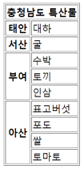

# Mini Project Quiz

## 01. HTML Tag

HTML은 태그들의 집합이며, 태그는 HTML에서 가장 중요하고 기본이 되는 규칙입니다.

대부분 태그들은 시작태그와 종료태그로 이루어져 있지만, 종료태그가 없는 단일 태그(빈 태그)도 존재합니다.

단일 태그들에는 어떤 태그들이 있는지 아래의 답안을 채워보세요.

1. Break의 약자로, 줄을 바꿀 수 있는 태그입니다. :

2. Horizontal Rule의 약자로, 수평선을 그릴 수 있는 태그입니다. :

3. image의 약자로, 이미지를 담을 수 있는 태그입니다. :

4. 일반적으로 <head> 태그 안에서 쓰이며, meta data를 정의하며 문서 그 자체를 설명하는 태그입니다. :

5. 일반적으로 <head> 태그 안에서 쓰이며, 외부에 있는 문서를 연결해주는 태그입니다. :

6. 일반적으로 <form> 태그 안에서 쓰이며, type이라는 속성을 이용해 입력 양식을 여러가지로 변경하여 사용하는 태그입니다. :

### 정답

<details>
<summary>정답 확인하기</summary>
<div markdown="1">

1. br
2. hr
3. img
4. meta
5. link
6. input

</div>
</details>

## 02. HTML Table

테이블을 구성하는 방법에는 강의에서 학습한 내용 외에 다른 방법도 있습니다.

다음 빈 칸을 채워 아래와 같은 결과가 나올 수 있도록 코드를 작성해보세요.



```html
<table _____(1)_____>
  <tr>
    <th _____(2)_____>충청남도 특산물</th>
  </tr>
  <tr>
    <th>태안</th>
    <td>대하</td>
  </tr>
  <tr>
    <th>서산</th>
    <td>굴</td>
  </tr>
  <tr>
    <th _____(3)_____>부여</th>
    <td>수박</td>
  </tr>
  <tr>
    <td>토끼</td>
  </tr>
  <tr>
    <td>인삼</td>
  </tr>
  <tr>
    <th _____(4)_____>아산</th>
    <td>표고버섯</td>
  </tr>
  <tr>
    <td>포도</td>
  </tr>
  <tr>
    <td>쌀</td>
  </tr>
  <tr>
    <td>토마토</td>
  </tr>
</table>
```

### 정답

<details>
<summary>정답 확인하기</summary>
<div markdown="1">

1. border="1"
2. colspan="2"
3. rowspan="3"
4. rowspan="4"

</div>
</details>
